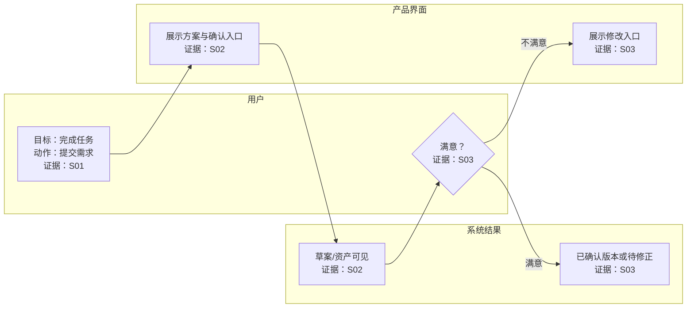

# 标准交付模块与模板

以下是完整产品逆向拆解的标准交付契约。先复用同一份证据账本，再按用户本轮范围选择模块；不要把同一证据在不同模块中改写成不同结论。

## A. 用户旅程（第一阶段）

### 必备输出顺序

1. **范围边界**：覆盖材料、目标用户、路径类型（正常/修改/异常）、明确不做的内容。
2. **用户旅程证据表**：

| 阶段 | 用户目标 | 截图中可验证的动作 | 页面反馈（可见） | 反馈类型 | 下一步行为 | 证据 |
|---|---|---|---|---|---|---|

反馈类型只能是“正向 / 中性 / 负向 / 尚未确认”，并说明依据；“下一步”是页面可见承接或标为推断。

3. **用户旅程图**：三泳道“用户 / 产品界面 / 系统结果”。每个节点写目标、动作/反馈、状态与证据；判断节点用菱形，分支写清条件。完整场景包含正常主流程、修改/纠偏、失败/中断；只要求正常路径时，明确排除未见分支。
4. **反馈观察**：将页面反馈分为正向、中性、负向；不要把主观体验包装为事实。
5. **可选深化**：用户情绪/想法（【合理推断】）、痛点、机会点、三个最值得讨论的问题。每个建议按“问题 → 影响 → 机会 → 验证方式”写。
6. **停止点**：若用户指定分轮，在此等待确认；不自动进入 Agent 或 Prompt。

### 旅程图骨架



这是表达骨架，非事实。删去无证据节点；未证实支路必须虚线并标“尚未确认”。

### 深度体验报告模式

当用户出现“生成报告、详细一点、导航设计、AI 功能、用户流程、体验评估”等意图时，按下列顺序输出；除非用户限定范围，不要用一张旅程表替代整份报告。

1. **研究范围与证据边界**：写清产品、材料编号、用户任务、路径范围；明确哪些流程、系统结果和数据不能确认。
2. **核心结论**：给 1–3 条能回答用户问题的机制级结论。结论必须分事实/推断；不得先写泛化洞察再找证据。
3. **证据账本**：

| 证据 | 页面事实 | 对当前问题的意义 |
|---|---|---|

4. **信息/导航架构拆解**：仅当材料涉及入口、目录、搜索、面包屑、标签、按钮、弹窗、AI 或跨页面跳转时输出。

| 导航层 | 用户此时的问题 | 可见入口/控件 | 系统或 AI 的角色 | 证据 |
|---|---|---|---|---|

5. **用户主流程**：按实际任务拆成一条或多条路径。不同截图没有连续证据时，称为“可观察路径集合”，不假装是同一用户会话。

| 阶段 | 用户目标 | 用户动作 | 页面反馈 | 用户决策/条件 | 下一步与状态 | 证据 |
|---|---|---|---|---|---|---|

6. **用户流程图**：至少三泳道“用户 / 产品界面 / 系统结果”；多个入口时必须画出分流判断。只有真实出现的修改、退出、客服、失败或恢复入口才画实线；未证实分支写“尚未确认”。
7. **关键机制分析**：逐项解释 AI、搜索、目录、表单、确认或状态提示在流程中的功能。每项采用：`页面事实 → 合理推断 → 尚未确认`，不要把界面位置直接解释为后台能力。
8. **反馈、感受与阻力**：反馈按正向/中性/负向列出；用户感受只标为【合理推断】。说明哪些行为降低认知负担，哪些地方让用户需要额外判断。
9. **最值得讨论的问题**：至少三项，格式固定为：`问题 → 影响 → 产品机会 → 验证方式`。机会必须对应前文证据与具体用户任务。
10. **可迁移设计原则**：只抽取本案例支持的机制，如“结构化导航与 AI 并行”“提供首次提问脚手架”“保留退出与人工兜底”。不要把单一产品文案当作通用原则。
11. **尚未确认的关键问题**：覆盖实际结果、状态写入/版本、失败/中断、权限/计费、上下文继承、跨端一致性等与本任务相关的缺口。

### 导航与 AI 功能的专门判断规则

- **先区分 AI 所在层级**：它是营销发现入口、产品内工作入口、帮助/支持入口，还是任务内协作入口；不因同名“AI”而假定能力相同。
- **识别并行路径**：目录/菜单、搜索、推荐、AI 对话、客服/人工支持可能同时存在。分别说明它们适合的用户状态和页面证据。
- **检查上下文线索**：AI 示例问题、当前页面标题、用户输入、搜索词、登录/团队状态是否有可见关联。没有关联证据时，明确“是否上下文感知尚未确认”。
- **检查闭环，而不只看入口**：入口 → 首次引导 → 提问/提交 → 结果 → 编辑/追问/反馈 → 失败或人工兜底。只显示入口而未显示结果时，不得评价 AI 回答质量或完成率。
- **把指标写成验证假设**：可建议跟踪入口曝光—点击—提问—首答—继续追问—任务完成—人工转接，但这些不是当前页面事实。
- **处理弹层与导航冲突**：观察浮层是否遮挡内容、是否可关闭、是否给出示例/下一步；“打扰”只能是推断，必须连接到可见位置与用户任务。

## B. Agent 契约与数据流（第二阶段）

### 必备输出顺序

1. **查看范围与证据缺口**：特别列出隐藏推理、内部 Prompt、官方工具名、运行时日志、账户敏感信息等不可得证据。
2. **Agent 清单**：按时间顺序，注明加入/触发/接替/交接/再次出现的证据。只出现名称而没有可归因行为，不算已出现 Agent。
3. **每个 Agent 的 I/O 契约卡**：固定十项：

```text
Agent：名称
1. 核心目标
2. 触发条件
3. 输入信息：用户当前输入 / 用户长期信息 / 项目全局上下文 /
   上游 Agent 输出 / 平台公共资产 / 工具或运行时结果
4. 可观察判断
5. 调用工具（功能命名，非官方工具名）
6. 输出信息：用户回复 / 页面组件 / 结构化字段 / 视觉或音视频资产 / 状态 / 下游任务
7. 全局上下文读写（字段、读/写、生产者、消费者、更新时机、证据）
8. 完成条件
9. 异常与重试
10. 尚未确认的问题
```

4. **工具总表**：

| 功能性工具名（非官方） | 关联 Agent | 页面证据与状态 | 不能据此断言 |
|---|---|---|---|

5. **全局上下文字段表**：

| 字段或对象 | 页面可见证据 | 读者/写者 | 证据等级 | 版本/状态风险 |
|---|---|---|---|

6. **数据生产者—消费者表**：

| 数据/资产 | 生产者 | 消费者 | 交接或引用证据 | 修改后的失效行为 | 证据 |
|---|---|---|---|---|---|

7. **输入—判断—工具—输出—交接流程图**：每个 Agent 节点必须写能力边界和证据；箭头只有存在交接文本、资产引用或可靠顺序证据时才画实线。
8. **事实、推断、未知清单**与**最值得验证的五个问题**。
9. **停止点**：等待用户选定目标 Agent；不直接写完整 System Prompt。

## C. 目标 Agent 的功能等价 Prompt（第三阶段）

仅在用户明确指定一位 Agent 后使用。先证明边界，再设计 Prompt；任何语义字段、工具名、重试/幂等策略若未公开，都必须是“推导设计/非官方命名”。

### 必备输出顺序

1. **目标 Agent 证据范围与十项边界问答**：解决问题、接管时刻、触发者、交给谁、属于它的工作、不属于它的工作、修改是否重触发、何时停止、何时自动继续、是否等待确认。
2. **输入契约**：六类来源逐项表格。

| 来源类型 | 输入项 | Agent 如何使用 | 必需性 | 等级与证据 |
|---|---|---|---|---|

3. **输出契约**：用户回复、页面组件、资产、全局上下文写入、下游任务与数据。

| 输出类型 | 页面可观察输出 | 功能等价的结构化表达 | 等级 |
|---|---|---|---|

4. **工具契约**：

| 功能性名称（非官方） | 触发与前置检查 | 成功后验证 | 失败/重试/中断 | 证据等级 |
|---|---|---|---|---|

5. **状态机与 Mermaid 图**：列清各状态允许/禁止的动作。图下必须把每条状态转移标记为事实、推断、建议或未知；不要让工程建议看起来像页面行为。
6. **四类规则**：`【事实规则】`、`【推断规则】`、`【建议规则】`、`【未知】`。
7. **功能等价 System Prompt**：使用固定 15 节：角色、核心目标、任务边界、输入契约、全局上下文协议、工作流程、工具调用规范、用户确认机制、结果验证、修改与回退、异常处理、状态机、下游交接、完成条件、输出格式。
8. **规则—证据追溯表**：

| Prompt 规则 | 分类 | 页面证据/推导依据 | 限制 |
|---|---|---|---|

9. **最小测试集**：正常完整输入、缺必要输入、局部修改、工具失败、用户中断、全局上下文与页面状态冲突。每项包含：

| 测试 | 测试输入 | 初始状态 | 预期判断 | 预期工具调用 | 预期状态变化 | 不允许出现的行为 |
|---|---|---|---|---|---|---|

10. **仍然无法确认的问题**，然后停止。

## D. 通用流程/状态模型

在不涉及 Agent 的产品中，仍以“输入—判断—执行—验证—交付/修正”的骨架表达，但只保留材料支持的状态：

| 状态 | 进入条件 | 允许动作 | 离开条件 | 证据 |
|---|---|---|---|---|

不得用通用状态机补齐产品未展示的取消、余额不足、失败或重试功能。

## E. 机会点

| 问题 | 受影响用户/任务 | 证据 | 可迁移机会 | 验证方法 |
|---|---|---|---|---|

机会点不是功能清单。优先提出能降低不确定性、暴露依赖、统一状态源、缩短返工或增强可恢复性的改变。
